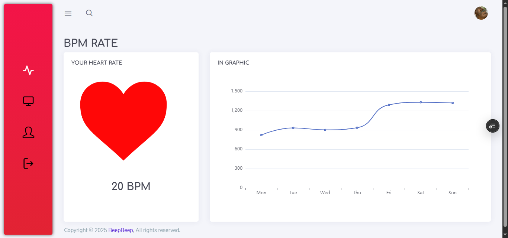

# ❤️ Heart Rate Monitoring UI

A **real-time web interface** designed for monitoring heart rate data from sensor nodes, created as a final project for the **Wireless Sensor Network** course in the **4th semester (2023)** at Politeknik Negeri Jakarta.

---

## 📌 Project Background

This project was part of a coursework submission for the **Wireless Sensor Network** subject, aiming to visualize real-time physiological data transmitted from wireless sensor devices (e.g., heart rate sensors).

It was developed with a focus on clean UI, accessible data presentation, and user-oriented interaction.

---

## 💻 Features

* 📊 Real-time heart rate monitoring dashboard
* 👤 User profile display
* 📁 Data table with historical heart rate entries
* 💡 Responsive layout using Bootstrap

---

## 🧰 Built With

* HTML5 & CSS3
* Bootstrap 4
* JavaScript (Basic DOM manipulation)

---

## 📂 File Structure

```
📁 heart-rate-monitor-main
🖾️ index.html          # Landing page
🖾️ dashboard.html      # Real-time heart rate data dashboard
🖾️ table.html          # Historical data table
🖾️ profile.html        # User profile page
📁 app-assets/         # CSS, JS, and image assets
```

---

## 📸 Screenshots



---

## 👨‍💻 Author

**Natanael Siwalette**
Student of Multimedia and Network Engineering
Politeknik Negeri Jakarta
Focus: IoT, Embedded Systems, and Web-Based Monitoring

---

## 🚀 Live Demo

[https://heart-rate-monitor.vercel.app/](https://heart-rate-monitor.vercel.app/)

---

Feel free to fork or reuse the interface for educational IoT/web-based monitoring projects.
